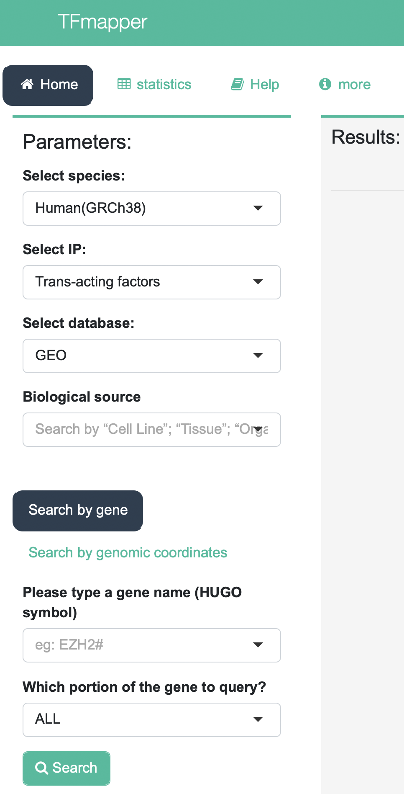

# Follow me to create a web-tool by shiny 

## Publications

Please cite our latest paper when using our TFmapper

- https://www.ncbi.nlm.nih.gov/pmc/articles/PMC6216026/
- http://www.ijbs.com/v14p1724.htm
- http://www.tfmapper.org/

## Contact

Jianming Zeng (PHD student in university of Macau) : jmzeng1314@163.com 

## Follow me 

### step1: create tables and database in MYSQL

First, make sure that the mysql client and server were installed successfully in your OS , and please remember the **password** for root user( the default user in mysql). 

Then you can log in by  `mysql -u root -p  `  

useful link ( once you forget the password ):

- https://www.variphy.com/kb/mac-os-x-reset-mysql-root-password

- https://stackoverflow.com/questions/6474775/setting-the-mysql-root-user-password-on-os-x

```mysql
show databases; 
create database tfmapperdb;
show databases;
CREATE USER tfmapperuser IDENTIFIED BY 'tfmapper_@Abc';
  GRANT ALL PRIVILEGES ON tfmapperdb.* TO 'tfmapperuser'@'%' IDENTIFIED BY 'tfmapper_@Abc';
FLUSH PRIVILEGES;
```

Now, you just need to use the tfmapperdb and tfmapperuser.

### step2:upload data in to your database

Firstly, we should download the information about genes in human and mouse from [GENCODE](https://www.gencodegenes.org/)

```shell
wget ftp://ftp.ebi.ac.uk/pub/databases/gencode/Gencode_human/release_29/gencode.v29.annotation.gtf.gz ## 38M
wget ftp://ftp.ebi.ac.uk/pub/databases/gencode/Gencode_mouse/release_M20/gencode.vM20.annotation.gtf.gz ## 25M

cat gencode.v29.annotation.gtf |perl -alne  '{next unless  $F[1] eq "HAVANA";next unless $F[2] eq "gene";/gene_id \"(.*?)\.\d+\"; gene_type \"(.*?)\"; gene_name \"(.*?)\"/;print "$3\t$2\t$1\t$F[0]\t$F[3]\t$F[4]"}' > gencode_v29_human_gene_info
cat gencode.vM20.annotation.gtf |perl -alne  '{next unless  $F[1] eq "HAVANA";next unless $F[2] eq "gene";/gene_id \"(.*?)\.\d+\"; gene_type \"(.*?)\"; gene_name \"(.*?)\"/;print "$3\t$2\t$1\t$F[0]\t$F[3]\t$F[4]"}' > gencode_vM20_mouse_gene_info
```

Then we can upload these files into our datbase by R codes below:

```r
library(RMySQL)
host <<- "127.0.0.1"
port <<- 3306
user <<- "tfmapperuser"
password <<-  'tfmapper_@Abc'
library(RMySQL)
con <- dbConnect(MySQL(), host=host, port=port, user=user, password=password)
sql="USE tfmapperdb;"
dbSendQuery(con, sql)
sql='show tables;'
dbGetQuery(con, sql)
options(stringsAsFactors = F)

a=read.table('files/gencode_v29_human_gene_info',sep = '\t')
head(a)
colnames(a)=c('symbol'   ,  'type' ,   'ensembl'   , 'chr' ,'start', 'end' )
dbWriteTable(con, 'gencode_v29_human_gene_info', a, append=F,row.names=F)
sql='show tables;'
dbGetQuery(con, sql) 
```

By this way, we should upload all the information for our web-tool into mysql.

Upload the txt files in to `cistrome_metadata`:

```
TF_human_information.txt
TF_mouse_data_information.txt
ca_human_data_information.txt
ca_mouse_data_information.txt
histone_human_data_information.txt
histone_mouse_data_information.txt
other_human_data_information.txt
other_mouse_data_information.txt
```

Pay attention that the columns for this table: 

```
sampleID       GSM    bs1                 bs2      bs3       IP species    type
```

gather all the GSM IDs and search the details by using GEOmetadb then upload them into `cistrome_GSM_metadata` 

Pay attention that the columns for this table: 

```
[1] "ID"                     "title"                  "gsm"                   
[4] "series_id"              "gpl"                    "status"           
············
```

Lastly, upload all the `peaks annotation files`  to mysql ( extremely time consuming and really big size ), about `200` tables. (by chromosome, database,type,species)

You should read my codes from begin to end: [upload_into_mysql.R](scripts/upload_into_mysql.R)

Please send me email to request those files ( about 100 Gb)

### step3: create user interface

With the help of Xiaojie Sun, We create a beautiful `ui` framework, as below :




There are 4 pages in our tool, which are : home, statistics, more, help.

You can check the codes in [UI](ui.R)

Please remember the `IDs` we create in UI page:

- input values 
  - species(human or mouse )/IP(TF or 	histone)/database(cistrome or ENCODE)/cellline( too many )
  - input_gene/genomic_feature
  - position, such as '18:28176327,28178670'

- output values 
  - DT::dataTableOutput('results') 
  - plotOutput('results_stat')
  - DT::dataTableOutput('stat_table')


-  actionButton 
  - do_gene
  - do_position/zoom_in/zoom_out

### step4 : create server client

You can check the codes in [server](server.R)

#### part 1 : refresh two input button by updateSelectizeInput

check the codes  in [updateSelectizeInput](scripts/updateSelectizeInput.R)

the gene choices  depends on the `species` user choosed ( we should search all the genes from mysql)

 the cellLine choices  depends on the database and species and IP  user choosed

#### part 2 : get the specific position for choosed gene

check the codes  in [positions.R](scripts/positions.R)

Get the position of choosed gene according to GENCODE database. ( gencode_v29_human_gene_info  and  gencode_vM20_mouse_gene_info  in mysql) 

first the choosed gene will change the positon.the zoom_in and zoom_out will also change the position.

#### part 3 :  search peaks by gene

Check the codes in [search_by_gene.R](scripts/search_by_gene.R)

Once the user click the button for searching by gene, we should return the result table( the peaks information).

```r
paste0(" select * from ",peaks_tab," where symbol=",shQuote(gene) ) 
```

#### part 4 :  search peaks by position

Check the codes in [search_by_position.R](scripts/search_by_position.R) 

The similar codes as above, this time we don't search peaks by gene, instead of position.

```r
paste0("select * from ",peaks_tab," where start > ",start," and end < ",end)
```

#### part 5 : reture the peaks table.

Check the codes in [output_main_result_table.R](scripts/output_main_result_table.R)

this table is a little complicate. 

#### part 6 : referesh links

Check the codes in [output_links.R](scripts/output_links.R)

There are  two files : downloadData_csv and  downloadData_bed and  one link : uiOutput('washUlink')  

#### part 7 : 

Check the codes in [output_stat.R](scripts/output_stat.R)


## Papers citing [TFmapper](www.tfmapper.org/)

So far, no paper cite this tool.